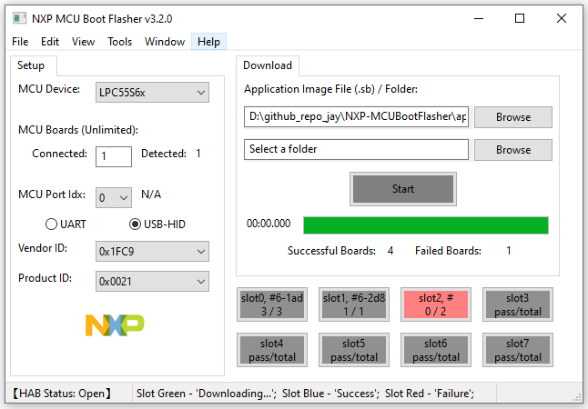

# NXP MCU Boot Flasher

[](https://github.com/JayHeng/NXP-MCUBootFlasher/releases/latest) [](https://github.com/JayHeng/NXP-MCUBootFlasher/compare/v3.2.0...master)  [](https://github.com/JayHeng/NXP-MCUBootFlasher/blob/master/LICENSE)

English | [中文](./README-zh.md)

```text
对于MCUBootUtility，MCUBootFlasher（RT-Flash）工具，有任何使用上的问题，可以在《痞子衡嵌入式》博客下留言，也可以扫码加入QQ交流群。  
```



### 1 Overview
#### 1.1 Introduction
　　NXP-MCUBootFlasher is a GUI tool specially designed for NXP MCU production. Its feature is similar to MfgTool2, but it solves below limitaions of MfgTool2:  

> * The .sb file can only be specified in xml file;  
> * USB port is the only choice to download .sb file;  
> * Sometimes USB Hub is required to connect;  
> * Maximum four boards can be supported for batch downloading  

　　With NXP-MCUBootFlasher, you can easily get started with NXP MCU secure boot. The main features of NXP-MCUBootFlasher include：  

> * Support i.MXRT1011, i.MXRT1015, i.MXRT1021, i.MXRT1024 SIP, i.MXRT1051/1052, i.MXRT1061/1062, i.MXRT1064 SIP, i.MXRT116x, i.MXRT117x 
> * Support Kinetis, LPC5500 Series
> * Support both UART and USB-HID serial downloader modes  
> * Support for loading .sb image file into boot device  
> * Support batch downloading for multiple image files in one folder
> * Can download image automatically via USB when new board is connected
> * Can download image into 8 boards via USB at the same time
> * Can show pass/total info for each slot

#### 1.2 Download
　　NXP-MCUBootFlasher is developed in Python, and it is open source. The development environment is Python 2.7.15 (32bit), wxPython 4.0.3, pySerial 3.4, pywinusb 0.4.2, PyInstaller 3.3.1 (or higher).  

> * Source code: https://github.com/JayHeng/NXP-MCUBootFlasher  
> * Feedback: https://www.cnblogs.com/henjay724/p/10776095.html  

　　NXP-MCUBootFlasher is packaged by PyInstaller, all Python dependencies have been packaged into an executable file (\NXP-MCUBootFlasher\bin\NXP-MCUBootFlasher.exe), so if you do not want to develop NXP-MCUBootFlasher for new feature, there is no need to install any Python software or related libraries.  

> Note1: The NXP-MCUBootFlasher.exe in the source code package is packaged in the Windows 10 x64 environment and has only been tested in this environment. If it cannot be used directly for system environment reasons, you need to install [Python2.7.15 x86 version ](https://www.python.org/ftp/python/2.7.15/python-2.7.15.msi)(Confirm that the directory "\Python27\" and "\Python27\Scripts\" are in the system environment variable path after the installation is completed), then click on "do_setup_by_pip.bat" in the "\NXP-MCUBootFlasher\env\" directory to install the Python library on which NXP-MCUBootFlasher depends. Finally, click "do_pack_by_pyinstaller.bat" to regenerate the NXP-MCUBootFlasher.exe.  

> Note2: You must use Python2 x86 version, because NXP-MCUBootFlasher uses the pywinusb library, which cannot be packaged by PyInstaller in Python2 x64 version. The pywinusb author has no plan to fix the problem.  

#### 1.3 Installation
　　NXP-MCUBootFlasher is a pure green free installation tool. After downloading the source code package, double-click "\NXP-MCUBootFlasher\bin\NXP-MCUBootFlasher.exe" to use it. No additional software is required.  
　　Before the NXP-MCUBootFlasher.exe graphical interface is displayed, a console window will pop up first. The console will work along with the NXP-MCUBootFlasher.exe graphical interface. The console is mainly for the purpose of showing error information of NXP-MCUBootFlasher.exe. At present, NXP-MCUBootFlasher is still in development stage, and the console will be removed when the NXP-MCUBootFlasher is fully validated.

#### 1.4 Contents
　　The NXP-MCUBootFlasher software directory is organized as follows:  
```text
\NXP-MCUBootFlasher
                \apps                 --Place example source image files
                \bin                  --Place NXP-MCUBootFlasher.exe file
                \env                  --Place scripts to install the NXP-MCUBootFlasher development environment and to do package
                \gui                  --Place NXP-MCUBootFlasher development UI build project file
                \img                  --Place the image to be loaded during the use of NXP-MCUBootFlasher
                \src                  --Place all Python source code files for developing NXP-MCUBootFlasher
                \tools                --Place all external programs to be called during the use of NXP-MCUBootFlasher
                      \blhost             -- Host command line tool to communicate with Flashloader
                      \sdphost            -- Host command line tool to communicate with ROM
```
#### 1.5 Interface
　　The following figure shows the main interface of the NXP-MCUBootFlasher tool. The interface consists of four parts. The functions of each part are as follows:  


> * [Menu Bar]: Functional menu bar, providing general software settings.  
> * [Setup Window]: Target device setting bar, providing MCU Device options, serial interface options.  
> * [Download Window]: Boot main interface, providing all-in-one operation.  
> * [Status Bar]: Status bar, showing runtime infomation  

### 2 Preparation
　　There are two main preparations before using the NXP-MCUBootFlasher tool: 1. Prepare the i.MXRT hardware board and the serial download cable (USB/UART). 2. Prepare the .sb image file for downloading into Flash.  
　　For serial download line connections, you need to check the System Boot chapter of the i.MXRT Reference Manual to ensure that the connected UART/USB pins are specified by the BootROM.  
　　Regarding the .sb image file preparation, the NXP-MCUBootUtility tool (v1.2.0 or higher) can recognize the images of the five common formats (elf/axf/srec/hex/bin) and convert the image into .sb file.  
　　If you just want to quickly verify the NXP-MCUBootFlasher tool, all the led_blinky application .sb image files of NXP's official i.MXRT evaluation boards are stored by default in the NXP-MCUBootFlasher\apps folder.  

### 3 Basic Usage
#### 3.1 Setting target chip
　　When using NXP-MCUBootFlasher, you need to configure the target device. The target device includes MCU Device. Taking the NXP official development board EVK-MIMXRT1060 as an example, the main chip of the development board is i.MXRT1062DVL6A, so [RT Device] should be set to i.MXRT106x.  


#### 3.2 Setting download port
　　After setting up the target device, the next step is to connect the target device. Taking the USB-HID interface as an example, supply power to the EVK-MIMXRT1060 board, and connect the PC to the J9 port with USB Cable. If everything is going well, you can find new HID device (vid=0x1fc9, pid=0x0135) named HID-compliant vendor-defined device is enumerated. If the HID device is not found, please check the board SW7 DIP switch to set Boot Mode to 2'b01(Serial Downloader mode).  


　　After confirming the existence of the HID device, select USB-HID.  


#### 3.3 Clicking [Start] Button
　　At first, you should select your .sb file, then just click [Start] button, if the .sb file has been downloaded successfully, the value of [Successful Boards] will be 1.  


#### 3.4 Batch downloading
##### 3.4.1 Multiple files
　　If you want to download multiple image files once, you need to put all these image files into one folder and then choose this folder in tool, finally just click [Start] button.   


##### 3.4.2 Multiple boards
　　If you want to download image into multiple boards once, you need to set actual board number in [Connected] field, not that you have to push 'Enter' in your keyboard to confirm the board number. If USB port is selected, you can see the detected board number in [Detected] field, finally just click [Start] button.  


　　If UART port is selected, you have to set every port in [RT Port Index] manually and make sure the status is 'Already Set'.   


#### 3.5 When HAB is closed
　　When HAB is closed, the you need to put signed flashloader file into NXP-MCUBootFlasher folder，and the signed flashloader file must be named ivt_flashloader_signed.bin.  


　　Besides, you should make sure below two variables in bltargetconfig.py are aligned with signed flashloader。  


